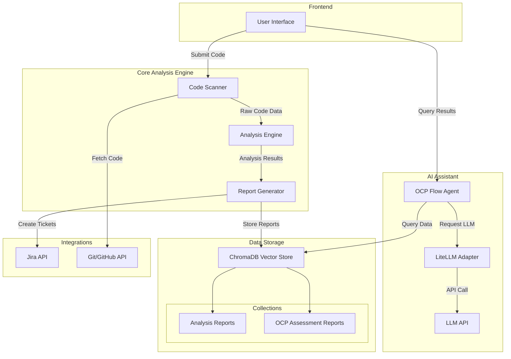

# OCP Migration Analyser

## Overview

The OCP Migration Analyser is a comprehensive tool designed to assist organizations in assessing their readiness for migration to OpenShift Container Platform (OCP). This application analyzes codebases, identifies potential issues, and provides actionable recommendations to ensure a smooth migration process.


## Key Features

- **Automated Code Analysis**: Scans codebases to identify migration challenges
- **Security & Quality Assessment**: Evaluates implementation of security and quality best practices
- **Component Detection**: Identifies technology components in use and verifies against declared inventory
- **AI-Powered Insights**: Uses LLM technology to provide context-aware recommendations
- **Jira Integration**: Links findings to actionable tickets in Jira for tracking remediation

## System Architecture



## Components

### 1. Code Analyser

The core component that scans codebases and identifies:
- Technology stack (languages, frameworks, libraries)
- Dependencies and components
- Architectural patterns
- Potential migration blockers

### 2. Report Generator

Creates comprehensive reports containing:
- Executive summary
- Component analysis
- Technology stack inventory
- Security & quality assessment
- Findings and recommendations
- Prioritized action items

### 3. ChromaDB Vector Store

Stores and indexes:
- Analysis reports
- Assessment reports
- Historical data for comparison

### 4. AI Assistant (OCP Flow Agent)

An intelligent interface that:
- Answers questions about migration readiness
- Provides contextual insights from reports
- Offers recommendations based on best practices
- Uses GPT-3.5-Turbo via LiteLLM adapter

## Installation

```bash
# Clone repository
git clone https://github.com/your-org/ocp_analyser.git
cd ocp_analyser

# Install dependencies
pip install -r requirements.txt

# Set up environment variables
cp .env.example .env
# Edit .env with your API keys and configuration

# Initialize ChromaDB
python utils/init_db.py

# Start the local LLM server (if using local deployment)
python -m llm_server.serve

# Run the application
python main.py
```

## Usage

### Command Line Interface

```bash
# Analyze a codebase
python -m analyzer.scan --path /path/to/code --output ./reports

# Query existing reports
python -m agent.query "What security issues were found in the latest scan?"

# Generate a migration plan
python -m planner.generate --report-id latest
```

### API Endpoints

```
POST /api/analyze
    - Submit code for analysis

GET /api/reports
    - Retrieve analysis reports

POST /api/query
    - Query the AI assistant
```

### OCP Flow Agent

```python
from agent.ocp_flow.agent import root_agent

# Ask questions about migration readiness
response = root_agent.generate_content("What are the key security findings in our latest assessment?")
print(response)

# Request specific analysis
response = root_agent.generate_content("Analyze our error handling implementation")
print(response)
```

## Report Structure

Analysis reports include:

1. **Executive Summary**
   - Implementation status of security & quality best practices
   - Overall findings and areas for improvement

2. **Component Analysis**
   - Declared vs. detected components (Redis, Kafka, LDAP, etc.)
   - System inventory verification

3. **Technology Stack**
   - Languages, frameworks, libraries
   - Databases and infrastructure components

4. **Security & Quality Analysis**
   - Auditability, availability, error handling
   - Monitoring and testing implementation
   - Best practice implementation status

5. **Findings**
   - Potential gaps and issues
   - Risk assessment

6. **Action Items**
   - Prioritized remediation tasks
   - Implementation recommendations

7. **Jira Integration**
   - Linked Jira stories with status
   - Descriptions, comments, and attachments

## Development

### Project Structure

```
ocp_analyser/
├── agent/                 # AI agent components
│   └── ocp_flow/          # OCP migration assessment agent
├── analyzer/              # Code analysis components
├── data/                  # Data models and schemas
├── utils/                 # Utility functions
│   └── chromadb_store.py  # ChromaDB interaction utility
├── reports/               # Generated reports
├── tests/                 # Test suite
├── web/                   # Web interface (if applicable)
├── .env.example           # Environment variables template
├── requirements.txt       # Python dependencies
└── README.md              # This file
```

### Adding New Capabilities

1. **New Analysis Rules**:
   Add to `analyzer/rules/` directory

2. **New Agent Tools**:
   Implement as functions and add to agent's tools list

3. **New Report Types**:
   Extend the Reporter class in `analyzer/reporter.py`

## Configuration

The application can be configured via environment variables:

```
# LLM Configuration
LLM_PROVIDER=openai
LLM_API_KEY=your_api_key
LLM_BASE_URL=http://localhost:1234/v1  # For local deployment

# ChromaDB Configuration
CHROMADB_HOST=localhost
CHROMADB_PORT=8000

# Jira Integration
JIRA_URL=https://your-org.atlassian.net
JIRA_USERNAME=your_username
JIRA_API_TOKEN=your_api_token
```

